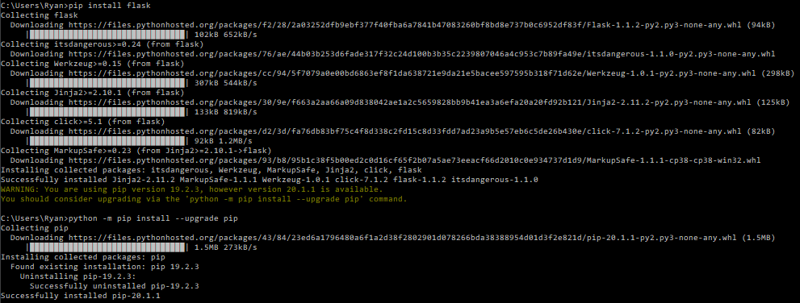
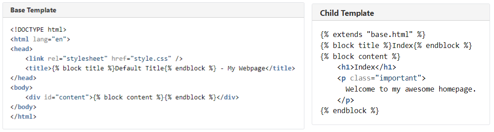

# Libraries and the Flask web framework

**Pages**
| Previous | Home | Next |
|---|---|---|
| [Fundamentals](https://github.com/rysharprules/Rython/blob/master/01_fundamentals.md) | [Home](https://github.com/rysharprules/Rython) | [Input/Output](https://github.com/rysharprules/Rython/blob/master/03_io.md) |

----

**Contents**
- [Libraries and the Flask web framework](#libraries-and-the-flask-web-framework)
  - [Packages](#packages)
    - [Importing](#importing)
    - [Virtual Environments](#virtual-environments)
      - [Creating a virtual enviroment](#creating-a-virtual-enviroment)
  - [Flask Framework](#flask-framework)
    - [Routing](#routing)
      - [Setting Status Codes](#setting-status-codes)
    - [Templates](#templates)
      - [`url_for`](#url_for)
      - [Static pages](#static-pages)
      - [Includes and Extends](#includes-and-extends)
    - [Accessing request data](#accessing-request-data)
      - [Query parameters](#query-parameters)
  - [Making requests](#making-requests)
    - [`GET`](#get)
    - [`POST`](#post)
    - [`PUT`](#put)
    - [`DELETE`](#delete)
    - [Status Codes](#status-codes)

## Packages

The most popular tool for installing Python packages is [**pip**](https://pip.pypa.io/en/stable/), which is included with all modern versions of Python. It provides the core features for finding, downloading, and installing packages from the [Python Package Index](https://pypi.org/) (**PyPI**) and other Python package repositories, and is designed to be used from
the command line / terminal.

It's pretty simple to install a package using pip:

`pip install some-package-name`

This will install the latest version of the package (assuming it exists on PyPI). You can specify an exact version when installing a package, for example:

`pip install some-package-name==1.4`

Other version specifiers can be found here: https://www.python.org/dev/peps/pep-0440#versionspecifiers

You can install multiple packages with a [requirements.txt](https://pip.pypa.io/en/stable/user_guide/#requirements-files) file:

`pip install -r requirements.txt`

### Importing

`import abc`

The first thing Python will do is look up the name `abc` in [sys.modules](https://docs.python.org/3/library/sys.html#sys.modules). This is a cache of all modules that have been previously imported.

If the name isn’t found in the module cache, Python will proceed to search through a list of built-in modules. These are modules that come pre-installed with Python and can be found in the [Python Standard Library](https://docs.python.org/3/library/). If the name still isn’t found in the built-in modules, Python then searches for it in a list of directories defined by [sys.path](https://docs.python.org/3/library/sys.html#sys.path). This list usually includes the current directory, which is searched first.

When Python finds the module, it binds it to a name in the local scope. This means that abc is now defined and can be used in the current file without throwing a `NameError`.

If the name is never found, you’ll get a `ModuleNotFoundError`.

In the example above, `abc` can be a package or a module. When you use the second syntax, you `import` the resource from another package or module. Here’s an example:

`from abc import xyz`

`xyz` can be a module, subpackage, or object, such as a class or function.

`import abc as other_name`

This renames the imported resource `abc` to `other_name` within the script. It must now be referenced as `other_name`, or it will not be recognized.

### Virtual Environments

By default, all Python packages are installed in a common location on your machine. However, this can lead to problems when working on multiple projects that require different versions of the same package.

The [**Python virtual environment**](https://docs.python.org/3/tutorial/venv.html) is a self-contained directory within the project directory that contains a dedicated Python installation for a particular version of Python, plus any packages needed by that project. Different projects can have their own virtual environments with the specific versions of the packages they need, and each virtual environment is isolated from the others, so there are no conflicts.

#### Creating a virtual enviroment

`python -m venv env`

This will create a virtual environment in a subdirectory called env. You then need to tell your terminal to use that environment for this project by activating the environment. On Windows machines, you do this using the following command:

`env\Scripts\activate.bat`

On Linux or macOS, run:

`env/bin/activate`

## Flask Framework

[Flask](https://palletsprojects.com/p/flask/) is considered to be a microframework (as opposed to a full-stack framework) because it focuses on providing the minimal functionality needed, while allowing for extensibility by other packages to provide things like database connectivity, authentication, etc. This has the benefit of making it lightweight and flexible.

You can install Flask with pip:



[See example 'Hello World' Flask web app](https://github.com/rysharprules/Rython/blob/master/rython/examples/flask/app.py). This can be run from command line within the same directory with:

`flask run`

This makes the app available on [http://127.0.0.1:5000/hello](http://127.0.0.1:5000/hello) (same as [localhost:5000/hello](localhost:5000/hello)).

Flask supports the three key capabilities an app needs to be considered a fully featured application:

1. **Display a user interface**: the presentation of data, input fields and buttons or links to allow actions to be triggered via **HTML templating**. HTML templating allows the app to generate HTML dynamically based on app logic and the relevant data to be displayed.
1. **Trigger an action**: for example, to view existing data, add or delete data, or search for results via **request routing**. Request routing allows the web app to match those requests to associated actions and triggers the relevant app code.
1. **Submit complex data**: for example, user details during registration, details of a new product, etc. via **parsing request data**. Users submit data by filling in HTML forms generated by the app, then clicking the form's submit button. This data is sent in the HTTP request from their browser and Flask processes (or _parses_) that request data so that the app can access and use it (to save it to a database, for example).

### Routing

In Flask, you use the `route()` decorator to associate a function to a URL path (and optionally an HTTP method). Taking a library app example:

````
@app.route('/books')
def get_books():
  """ Code to fetch all books from the database and return their details. """

@app.route('/books/<id>')
def get_book(id):
  """ Code to fetch the book entry with matching id from the database and 
return its details. """

@app.route('/books', methods=['POST'])
def add_book():
  """ Code to create a new book entry in the database. """
```` 

Flask treats anything inside angle brackets `<...>` specially, and will extract the corresponding value from the path in an incoming request and pass it as an
argument to the function.

In the above example, requests with URL paths `/books/1` and `/books/27` would cause Flask to call `get_book(1)` and `get_book(27)`, respectively. These are called **variable rules** in Flask and are used to determine what _entity_ the action should be performed on. Variable rules are also capable of extracting more complex values from request paths and validating that those values match an expected format. You can read more about them in the [Flask documentation](https://flask.palletsprojects.com/en/1.1.x/quickstart/#variable-rules).

#### Setting Status Codes

Flask methods (or view functions) can optionally return HTTP status codes as a second return value (as a tuple):

````
@app.route('/')
def homepage():
  return 'Hello There!', 200 # OK
````

This can be useful for returning error status codes:

````
@app.route('/book/<id>')
def get_book(id):
  try:
    return dictionary[id], 200
  except KeyError:
    return f"No book found with id: {id}", 400 # Bad Request
````

More detail on what can be returned from view functions can be found at [flask.palletsprojects.com](https://flask.palletsprojects.com/en/1.1.x/quickstart/#about-responses).

### Templates

Templates allow you to write files containing standard HTML, but use special keywords to add logic and include data from the app, which the template engine then converts into the necessary HTML. Flask uses the [Jinja2](https://palletsprojects.com/p/jinja/) template engine and provides the `render_template()` function to render the HTML from a given template. That function takes the filename of the template as its first argument and any data to be passed to the template as optional keyword arguments.

````
@app.route('/books')
def get_books():
  books = get_all_books_from_db() # Some function that returns the list of book entries from the database.
  return render_template('book_list.html', books=books)
````

_Note - you will need to import the `render_template` function, e.g. `from flask import Flask, render_template`_

Flask will look for templates (`.html` files) in the templates folder: `/templates/...`

Here's the `book_list.html` template, which uses the books variable that is passed in by the `render_template()` function:

````
<!doctype html>
<html>
  <head>
    <title>All Books</title>
  </head>
  <body>
    <ul>
    
      <li>
        {{ book.title }} - {{book.authors}}
        <a href="/books/{{ book.id }}">View Details</a>
      </li>
    
    </ul>
  </body>
</html>
````

Included above are:

1. **Statements**: `` are for flow control — in this case, these define the start and end of a `for` loop to iterate over the list of books that are stored in the `books` variable.
1. **Expressions**: `{{ ... }}` evaluate a Python expression and populate the HTML with the result — in this case, the values of `book.title`, `book.author`, and `book.id` for each element in the `books` list are inserted into the generated HTML.

_Note: In Python, we normally don't need to end for loops or other flow control blocks, since the interpreter is able to determine when the loop ends from the indentation in the file. This is not true for Jinja templates, `endfor` is explicitly required. This is the same for `if` statements, using `endif`._

#### `url_for`

we could replace the hardcoded “/books/1" path with the url_for() function:

`<a href=“{{ url_for('get_book', id=book.id) }}">View Details</a>`

When Flask generates the HTML from this template, it will call `url_for()` and replace it in the final HTML with the return value from that function ("`/books/1`").

You can read more about the template syntax in the official [Jinja2 template documentation](https://jinja.palletsprojects.com/en/2.11.x/templates/).

#### Static pages

If you have a static `.html` page you can use the `send_static_file(<file_name>.html)` Flask function. Flask will look for static content in the `/static/...` folder.

#### Includes and Extends

You can include one template within another with `include`:

````

  Body

````

One template can _inherit_ from another with `extends`:



### Accessing request data

Data is provided by the [request object](https://flask.palletsprojects.com/en/1.1.x/quickstart/#the-request-object).

````
from flask import request

@app.route('/login', methods=['POST'])
def login():
  username = request.form['username']
  password = request.form['password']
  if valid_login(username, password):
    return log_the_user_in(username)
  else:
    error = 'Invalid username/password'
    return render_template('login_error.html', error=error)
````

#### Query parameters

Query parameters can be obtained using `request.args[<param_name>]` from `request`.

## Making requests

These examples use the [rem-rest-api.herokuapp.com](https://rem-rest-api.herokuapp.com/#what-rem-offers) example RESTful services.

Use the `requests` library:

`import requests`

See a [quick start guide here](https://realpython.com/python-requests/#getting-started-with-requests).

### `GET`

Use the `get` method with the URL as the argument. Parses the data (JSON content) to a Python object with the `json` method. 

````
response = requests.get('http://rem-rest-api.herokuapp.com/api/users')
data = response.json()
````

### `POST`

Use the `post` method with the URL and the data to add as the arguments.

````
monster = {"name": "Godzilla", "location": "Tokyo"}
response = requests.post('http://rem-rest-api.herokuapp.com/api/monster', json=monster)
````

### `PUT`

Similar to `POST`, but as this is an update operation, the `id` is required in the URL path and the data. Here we use the `put` method from `requests`.

````
response = requests.put('http://rem-rest-api.herokuapp.com/api/monster/1', json={"id": 1, "name": "Gojira", "location": "Tokyo"})
````

### `DELETE`

Finally, `DELETE` removes the record. The `delete` method requires only the URL path which includes the `id` of the record to be removed.

````
response = requests.delete('http://rem-rest-api.herokuapp.com/api/monster/1')
````

These APIs return the record(s) found, created or upated. In this instance, as the record is removed, it returns `None`.

### Status Codes

We can get the status code from the response with:

`response.status_code`

This returns a number representing the status code, e.g. `200` for a successful response. This can be used to determine success of the response and how to act. For example, we can raise an error if the response isn't successful:

````
if response.status_code != 200:
    raise ApiError('GET /api/users {}'.format(response.status_code))
````